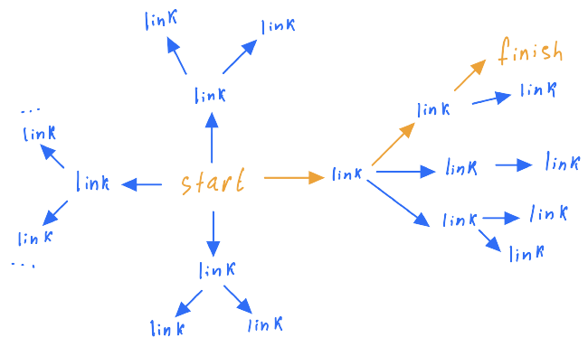

# wiki_link
##### project in progress
### To-Do List:
1. make a visual component and make it interacitve
1. optimize to improve the speed
1. try other path finding algorithms
I am trying to build an algorithm that finds the shortest route from a given starting Wiki link to a given finish Wiki link.

So far I implemented an algorithm that uses stacks and queues to find the shortest path from one link to another. 

For example we can go from [Shrek](https://en.wikipedia.org/wiki/Shrek_(character)) to [Trump](https://en.wikipedia.org/wiki/Donald_Trump) in just two links:
```
['https://en.wikipedia.org/wiki/Shrek_(character)', 'https://en.wikipedia.org/wiki/Hollywood_Walk_of_Fame', 'https://en.wikipedia.org/wiki/Donald_Trump']
you can reach your final destionation in 2 link(s)
```
